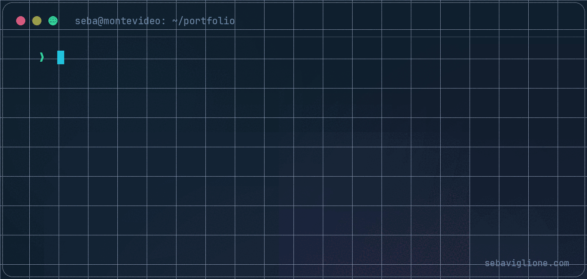
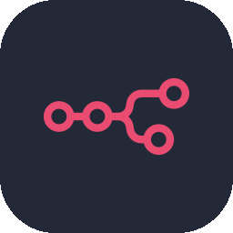
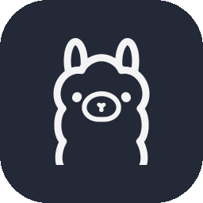
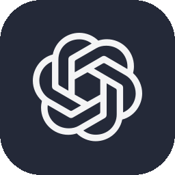
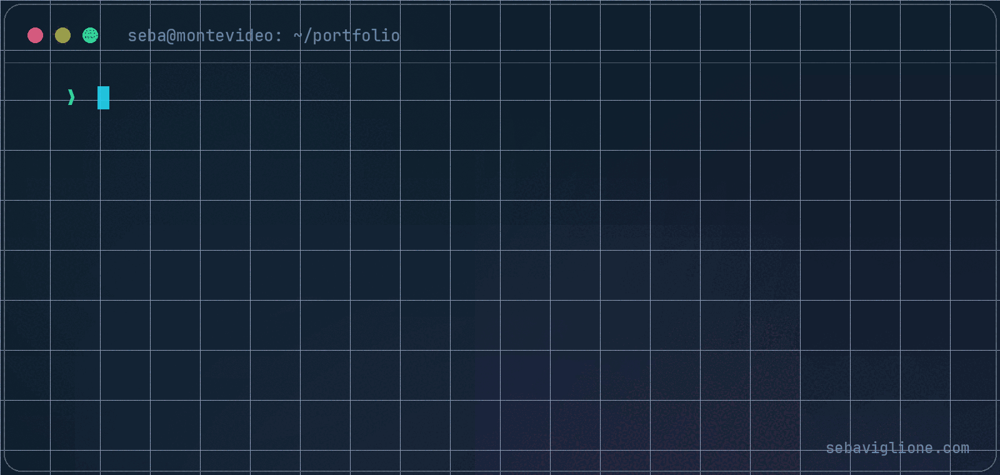

<!-- Banner principal -->

  

  <a href="#-english-version">🇬🇧 English version below</a>
  &nbsp;·&nbsp;
  

💻 <b>Developer & Systems Technician en <a href="https://grupocps.com.uy">Grupo CPS</a> | Automatización · IA local · Datos · Web</b> 
🎓 Estudiante de <b>Ingeniería en Sistemas</b> en la <b>Universidad de Montevideo</b> 
🚀 <i>«Hago software que ordena tu operación»</i> → <a href="https://sebaviglione.com">sebaviglione.com</a>

---

<h2 align="center">🚀 Sobre mí</h2>

Soy un desarrollador uruguayo que aprende construyendo. Desde fines de 2024 trabajo en <b>Grupo CPS</b>, donde desarrollo herramientas internas, automatizaciones y sitios web que resuelven problemas reales de la operación: scraping y procesamiento de datos, integración de APIs REST y webhooks, y flujos de negocio conectados con <b>Python, JavaScript/TypeScript y n8n</b>.

Mi zona favorita es donde se cruzan la <b>automatización</b> (n8n, Python), la <b>IA local</b> (Ollama, modelos ejecutados en mi propia infraestructura) y los <b>datos</b> (PostgreSQL, ETL, web scraping). En paralelo estudio Ingeniería en Sistemas y desarrollo proyectos freelance para clientes en Uruguay. Inglés avanzado C1 (Cambridge CAE).

---

<h2 align="center">🛠️ Tecnologías y Herramientas</h2>

<h3 align="center">🎨 Frontend</h3>

  

<h3 align="center">⚙️ Backend e Integraciones</h3>

  

<h3 align="center">🗄️ Bases de Datos</h3>

  

<h3 align="center">🤖 Automatización e IA</h3>

  &nbsp;&nbsp;&nbsp;&nbsp;

<h3 align="center">🧰 Infraestructura y Herramientas</h3>

  

---

<h2 align="center">🌟 Proyectos Destacados</h2>

### 🪟 [Cotizador de Aberturas](https://sebaviglione.com/cotizador)
> 📐 Aplicación B2B **full-stack de punta a punta** para cotizar aberturas de aluminio y vidrio: registro de clientes, configurador con **vista 3D y precio en vivo**, carrito, generación de PDF y seguimiento de pedidos.
>
> 🧮 Motor de cálculo de precios propio — geometría por tipología, despiece de perfiles, vidrios y accesorios — **calibrado por ingeniería inversa sobre 2.641 recetas reales de fábrica**, reduciendo el error de material de 2,44x a ~1% respecto al sistema interno.
>
> 🔧 Panel interno para técnicos: recetas parametrizables (perfiles, marcos, contravidrios, vidrios y costos) con reglas de resolución y fallback, validación de límites fabricables y APIs con control de acceso por rol.
>
> 🛠️ **Stack:** Next.js, React, TypeScript, Supabase (PostgreSQL), Three.js, Tailwind. → [Case study completo](https://sebaviglione.com/cotizador)

---

### 🤖 [ARCE Licitaciones – Monitor IA](https://github.com/SebaViglione/ARCE-LICITACIONES-IA)
> 🏗️ Sistema de monitoreo y análisis automático de licitaciones públicas del Estado uruguayo (ARCE), orientado al sector de aluminio, vidrio y aberturas — surgido de una necesidad real en Grupo CPS.
>
> ⚙️ **Pipeline 100% local, sin costos de API cloud:** n8n consulta el feed RSS de ARCE cada 15 minutos, un scraper Puppeteer extrae el detalle de cada llamado, la relevancia se analiza con **Llama 3.1 8b con prompt especializado vía Ollama**, y todo persiste con deduplicación en PostgreSQL (en Docker Compose).
>
> ✨ **Características destacadas:**
> - Extracción de texto multi-formato: PDF, DOC, DOCX, XLS y ZIP, con chunking automático para documentos grandes
> - Detección automática de fechas de visitas técnicas, lugares y contactos
> - Dashboard web filtrable (Express.js) para el equipo comercial
> - Scripts de verificación de extracción probados con documentos reales

---

### 📦 Manejador de Stock entre Depósitos
> 🏭 Herramienta interna desarrollada en Grupo CPS para ordenar el inventario de la empresa: stock por depósito, movimientos y transferencias entre depósitos, con trazabilidad de cada operación.
>
> 🔒 Proyecto interno de la empresa, sin repo público.

---

### 🌐 Webs con clientes reales
> 🏗️ [Grupo CPS](https://grupocps.com.uy) ([repo](https://github.com/SebaViglione/GrupoCPS_institucional)) — sitio institucional bilingüe de una constructora: portfolio de obras dinámico, formulario de contacto, SEO e imágenes WebP optimizadas.
>
> 🏋️ [Force Crossfit](https://forcebox4c.com.uy) · [Open Gym](https://opengym.uy) — sitios mobile-first para gimnasios, enfocados en que la gente llegue, entienda la propuesta y se contacte.
>
> 🏢 [Edificio Galicia](https://edificiogalicia.com.uy) — landing inmobiliaria para un desarrollo, con camino directo a la consulta.

---

### 🧪 Más proyectos

| Proyecto | Qué es | Stack |
|---|---|---|
| [payment_reconciliation_api](https://github.com/SebaViglione/payment_reconciliation_api) | 💳 Ejercicio backend de lógica financiera: concilia órdenes contra pagos y detecta faltantes, duplicados y montos que no cuadran | Node.js, TS, Prisma |
| [threejs-planet](https://github.com/SebaViglione/threejs-planet) | 🌍 Tierra 3D interactiva: atmósfera, nubes, luces nocturnas y satélites orbitando | Three.js |
| [draftosaurus-assistant](https://github.com/SebaViglione/draftosaurus-assistant) | 🦖 Chatbot experto en las reglas oficiales de Draftosaurus, con UX estilo ChatGPT | JS + OpenAI API |
| Draftosaurus Web 🔒 | 🎲 Versión web jugable del juego de mesa — proyecto final de UTU ISBO con el equipo Hackency (repo privado) | PHP, MariaDB, Docker |
| [Portafolio](https://github.com/SebaViglione/Portafolio) | ✨ Código de [sebaviglione.com](https://sebaviglione.com): animaciones con Framer Motion + GSAP, bilingüe ES/EN | Next.js, Tailwind |

---

<h2 align="center">📫 Conectemos</h2>

  
  
  
  

---

✨ <b>Gracias por visitar mi perfil</b> ✨ 
💬 Explorá mis repositorios y descubrí cómo combino <b>automatización, IA local y desarrollo web</b> en proyectos con uso real.

---

# 🌍 English Version

  

💻 <b>Developer & Systems Technician at <a href="https://grupocps.com.uy">Grupo CPS</a> | Automation · Local AI · Data · Web</b> 
🎓 <b>Systems Engineering</b> student at <b>Universidad de Montevideo</b> 
🚀 <i>"I build software that organizes your operation"</i> → <a href="https://sebaviglione.com/en">sebaviglione.com</a>

---

<h2 align="center">🧭 About Me</h2>

I'm a Uruguayan developer who learns by building. Since late 2024 I've been working at <b>Grupo CPS</b>, developing internal tools, automations, and websites that solve real operational problems: scraping and data processing, REST API and webhook integrations, and business workflows connected with <b>Python, JavaScript/TypeScript, and n8n</b>.

My favorite spot is where <b>automation</b> (n8n, Python), <b>local AI</b> (Ollama, models running on my own infrastructure), and <b>data</b> (PostgreSQL, ETL, web scraping) meet. In parallel, I'm studying Systems Engineering and building freelance projects for clients in Uruguay. Advanced English, C1 (Cambridge CAE).

---

<h2 align="center">🛠️ Technologies &amp; Tools</h2>

<h3 align="center">🎨 Frontend</h3>

  

<h3 align="center">⚙️ Backend &amp; Integrations</h3>

  

<h3 align="center">🗄️ Databases</h3>

  

<h3 align="center">🤖 Automation &amp; AI</h3>

  &nbsp;&nbsp;&nbsp;&nbsp;

<h3 align="center">🧰 Infrastructure &amp; Tools</h3>

  

---

<h2 align="center">🌟 Featured Projects</h2>

### 🪟 [Aluminum Joinery Quoter](https://sebaviglione.com/en/cotizador)
> 📐 End-to-end **full-stack B2B app** for quoting aluminum and glass windows and doors: client registration, configurator with a **live 3D view and real-time pricing**, cart, PDF generation, and order tracking.
>
> 🧮 Custom pricing engine — typology-based geometry, breakdown of profiles, glass, and hardware — **calibrated through reverse engineering over 2,641 real factory recipes**, cutting material error from 2.44x to ~1% vs. the internal system.
>
> 🔧 Internal panel for technicians: parameterizable recipes (profiles, frames, glazing beads, glass, and costs) with resolution and fallback rules, manufacturability validation, and role-based API access control.
>
> 🛠️ **Stack:** Next.js, React, TypeScript, Supabase (PostgreSQL), Three.js, Tailwind. → [Full case study](https://sebaviglione.com/en/cotizador)

---

### 🤖 [ARCE Licitaciones – AI Monitor](https://github.com/SebaViglione/ARCE-LICITACIONES-IA)
> 🏗️ Automated monitoring and analysis system for Uruguayan public tenders (ARCE), targeting the aluminum, glass, and window industry — born from a real need at Grupo CPS.
>
> ⚙️ **Fully local pipeline, zero cloud API costs:** n8n polls the ARCE RSS feed every 15 minutes, a Puppeteer scraper extracts each tender's details, relevance is analyzed with **Llama 3.1 8b using a domain-specialized prompt via Ollama**, and everything persists with deduplication in PostgreSQL (on Docker Compose).
>
> ✨ **Key features:**
> - Multi-format text extraction: PDF, DOC, DOCX, XLS, and ZIP, with automatic chunking for large documents
> - Automatic detection of technical site-visit dates, locations, and contacts
> - Filterable web dashboard (Express.js) for the sales team
> - Text-extraction verification scripts tested with real documents

---

### 📦 Warehouse Stock Manager
> 🏭 Internal tool built at Grupo CPS to keep the company's inventory in order: per-warehouse stock, movements, and transfers between warehouses, with traceability for every operation.
>
> 🔒 Internal company project, no public repo.

---

### 🌐 Websites for real clients
> 🏗️ [Grupo CPS](https://grupocps.com.uy) ([repo](https://github.com/SebaViglione/GrupoCPS_institucional)) — bilingual corporate site for a construction company: dynamic works portfolio, contact form, SEO, and optimized WebP images.
>
> 🏋️ [Force Crossfit](https://forcebox4c.com.uy) · [Open Gym](https://opengym.uy) — mobile-first gym websites focused on getting people to arrive, understand the offer, and reach out.
>
> 🏢 [Edificio Galicia](https://edificiogalicia.com.uy) — real-estate landing page for a development, with a direct path to inquiries.

---

### 🧪 More projects

| Project | What it is | Stack |
|---|---|---|
| [payment_reconciliation_api](https://github.com/SebaViglione/payment_reconciliation_api) | 💳 Backend exercise in financial logic: reconciles orders against payments, flagging missing, duplicate, and mismatched ones | Node.js, TS, Prisma |
| [threejs-planet](https://github.com/SebaViglione/threejs-planet) | 🌍 Interactive 3D Earth: atmosphere, clouds, night lights, and orbiting satellites | Three.js |
| [draftosaurus-assistant](https://github.com/SebaViglione/draftosaurus-assistant) | 🦖 Expert chatbot for the official Draftosaurus rules, with a ChatGPT-style UX | JS + OpenAI API |
| Draftosaurus Web 🔒 | 🎲 Playable web version of the board game — UTU ISBO final project with team Hackency (private repo) | PHP, MariaDB, Docker |
| [Portafolio](https://github.com/SebaViglione/Portafolio) | ✨ Source of [sebaviglione.com](https://sebaviglione.com): Framer Motion + GSAP animations, bilingual ES/EN | Next.js, Tailwind |

---

<h2 align="center">📫 Let's Connect</h2>

  
  
  
  

---

✨ <b>Thanks for visiting my profile!</b> ✨ 
💬 Explore my repositories to see how I blend <b>automation, local AI, and web development</b> into projects with real-world use.

  

