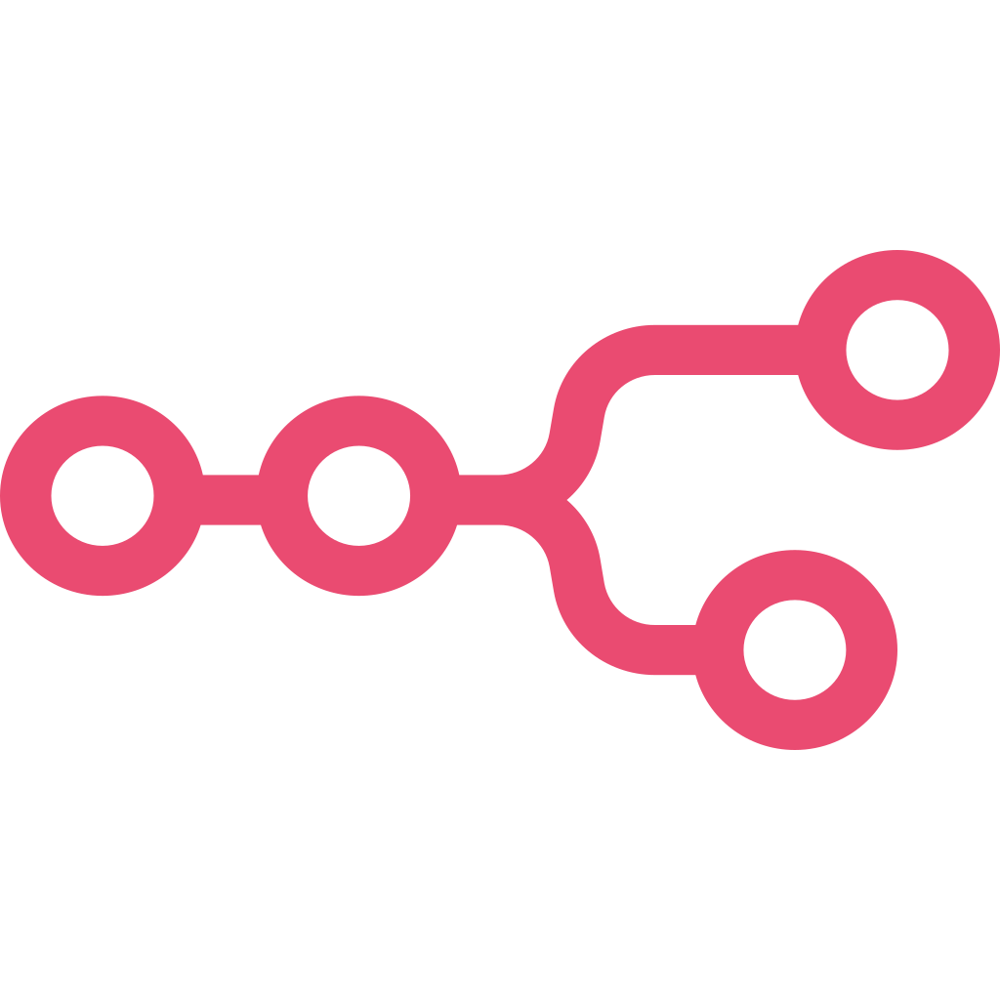

<!-- Banner principal -->
.png)

  

💻 <b>Desarrollador Full-Stack en formación | Automatización, IA local y procesamiento de datos</b> 
🌱 Estudiante de Informática en <b>UTU (Instituto Superior Brazo Oriental)</b> 
🚀 Apasionado por crear soluciones que integran <b>web, automatización y análisis inteligente de datos</b>.

---

<h2 align="center">🚀 Sobre mí</h2>

Soy un estudiante uruguayo de informática con un fuerte interés en el desarrollo full-stack y la automatización de procesos. 
Me gusta combinar la lógica de la programación con la creatividad del diseño, y aplicar la tecnología para resolver problemas reales.  
Actualmente estoy profundizando en el uso de <b>Docker, n8n, Ollama y PostgreSQL</b> para la integración de flujos de datos y sistemas IA locales.

---

<h2 align="center">🛠️ Tecnologías y Herramientas</h2>

  
  
  
  
  
  
  
  
  

---

<h2 align="center">📊 Actividad en GitHub</h2>

  

---

<h2 align="center">🌟 Proyectos Destacados</h2>

### 🤖 [ARCE Licitaciones – Monitor IA](https://github.com/SebaViglione/ARCE-LICITACIONES-IA)
> 🏗️ Sistema automatizado de monitoreo de licitaciones públicas de Uruguay, diseñado para resolver problemáticas reales del sector construcción (validado con datos de Grupo CPS).
> 
> 🔧 Utiliza n8n, Ollama (Llama 3.1 custom), PostgreSQL, Docker y OCR Tools para automatizar el ciclo completo: scraping, deduplicación, clasificación IA y notificaciones.
> ✨ Características destacadas
> 
> Extracción multi-formato: PDF, ODT, DOC, DOCX
> IA local fine-tuned (Llama 3.1 : 8b) para detección de licitaciones relevantes
> Suite de tests automatizados con casos reales
> Workflow n8n y deduplicación PostgreSQL en progreso
> 💬 Proyecto técnico de aplicación real orientado a la automatización de datos públicos y análisis inteligente de información empresarial.

---

### 🎲 [Draftosaurus](https://github.com/hackency/Draftosaurus)
> Proyecto académico grupal — desarrollo de una aplicación web para gestionar partidas del juego de mesa **Draftosaurus**.  
> 🛠️ **Stack:** HTML, CSS, JS, PHP, MariaDB, Docker.  
> 🧠 Participación en diseño de interfaz, documentación técnica y pruebas del sistema.  
> 🌍 Desarrollado junto al equipo **Hackency** como parte del Proyecto Final de Bachillerato en TI (UTU ISBO).

---

<h2 align="center">📫 Conectemos</h2>

  
  
  

---

✨ <b>Gracias por visitar mi perfil</b> ✨ 
💬 Explorá mis repositorios y descubrí cómo combino <b>automatización, IA y desarrollo web</b> en proyectos reales.

---

# 🌍 English Version

  

💻 <b>Full-Stack Developer in training | Automation, Local AI and Data Processing</b> 
🌱 IT student at <b>UTU (Instituto Superior Brazo Oriental)</b> 
🚀 Passionate about building systems that connect <b>web development, automation workflows, and AI-based data analysis</b>.

---

<h2 align="center">🧭 About Me</h2>

Uruguayan IT student passionate about full-stack development and process automation.  
I enjoy combining logical problem-solving with design and real-world applications, using tools like <b>n8n, Docker, Ollama, and PostgreSQL</b> to build data-driven and intelligent systems.

---

<h2 align="center">🛠️ Technologies & Tools</h2>

  
  
  
  
  
  
  
  
  

---

<h2 align="center">📊 GitHub Activity</h2>

  

---

<h2 align="center">🌟 Featured Projects</h2>

### 🤖 [ARCE Licitaciones – AI Monitor](https://github.com/SebaViglione/ARCE-LICITACIONES-IA)
> 🏗️ Automated monitoring system for Uruguay’s public tenders (ARCE), designed to solve real-world problems in the construction sector (validated with data from Grupo CPS).
> 
> ⚙️ Integrates n8n, Ollama (Llama 3.1 custom), PostgreSQL, and OCR tools to automate scraping, deduplication, AI classification, and Telegram notifications.
> ✨ Key Features
> 
> Multi-format extraction: PDF, ODT, DOC, DOCX
> Local AI model fine-tuned for construction-related bidding
> Automated test suite with real data
> n8n workflow and PostgreSQL deduplication in progress
> 💬 An applied technical project focused on public data automation and local AI for business intelligence.

---

### 🎲 [Draftosaurus](https://github.com/hackency/Draftosaurus)
> Academic group project — web application to manage **Draftosaurus** board-game sessions.  
> 🛠️ **Stack:** HTML, CSS, JS, PHP, MariaDB, Docker.  
> 🧠 Contributions: UI design, documentation, and testing.  
> 🌍 Developed as part of the final IT project at **UTU ISBO** under the **Hackency** team.

---

<h2 align="center">📫 Let's Connect</h2>

  
  
  

---

✨ <b>Thanks for visiting my profile!</b> ✨ 
💬 Feel free to explore my repositories and see how I blend <b>web development, automation, and AI</b> into real-world projects.

