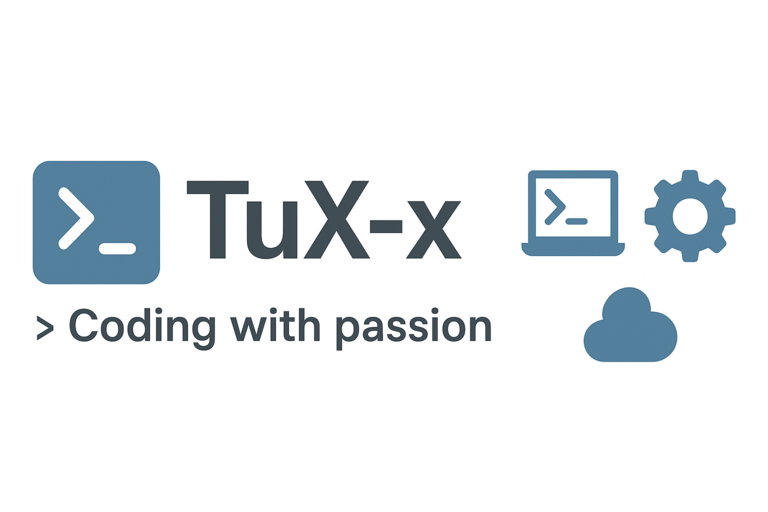

# 👋 ¡Hola! Soy Sebastián Viglione

💻 **Junior Web Developer** en formación  
🌱 Estudiante de Informática en UTU (Instituto Superior Brazo Oriental)  
🚀 Apasionado por el desarrollo **web full-stack** y el aprendizaje continuo  

---

## 🚀 Sobre mí

- 🌍 Vivo en Montevideo, Uruguay  
- 🧑‍💻 Experiencia creando proyectos académicos y personales con **HTML, CSS, JavaScript, PHP, MySQL y Git**  
- 📚 Actualmente ampliando conocimientos en **desarrollo full-stack** y buenas prácticas  
- 🎯 Objetivo: crecer como **Software Developer** y construir proyectos con impacto real  

---

## 📫 Conectemos

---

## 📊 Mi actividad en GitHub

---

✨ Gracias por visitar mi perfil ✨  
👉 ¡Explora mis repositorios para conocer mis proyectos!
